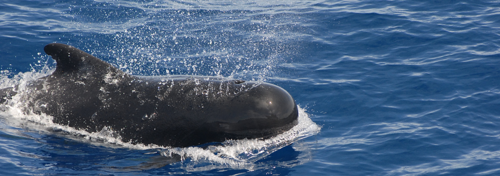

```{r}
#| label: setup
#| include: false
library(tidyverse)
library(gt)
```

# Introduction to the Mammalian Sleep Data Set

This report describes `msleep`, a data set of 83 mammals, including their body weight, brain size, total hours of sleep, and number of REM cycles.


